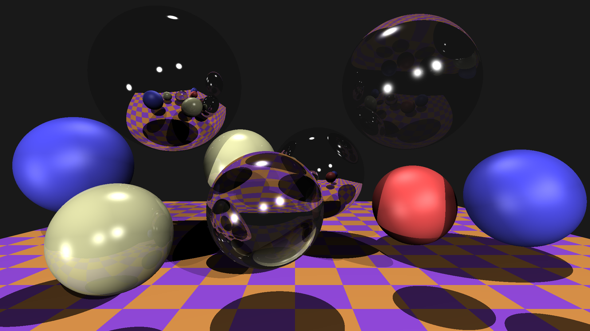

# 光线追踪

本项目不使用任何第三方库，实现了一个简易的光线追踪器，使用 C++17 编写。

## 渲染效果图



## 目录

- [光线追踪](#光线追踪)
  - [渲染效果图](#渲染效果图)
  - [目录](#目录)
  - [项目报告](#项目报告)
    - [1. 程序说明](#1-程序说明)
      - [1.1 本地安装](#11-本地安装)
      - [1.2 如何使用](#12-如何使用)
    - [2. 程序原理](#2-程序原理)
  - [贡献者](#贡献者)
  - [许可协议](#许可协议)
  - [参考文献](#参考文献)
  
## 项目报告

### 1. 程序说明

#### 1.1 本地安装

执行 `./scripts/build.sh` 以构建本项目。

如果你使用的是 Windows，一种选择是使用 WSL，或者你也可以手动下载安装 [MinGW-w64](https://sourceforge.net/projects/mingw-w64/files/mingw-w64/mingw-w64-release)，然后执行以下指令手动安装。

```bash
mingw32-make
```

#### 1.2 如何使用

执行 `./bin/tracer` 即可。由于我目前没有 Windows 环境，也没有 x86_64 环境，抱歉无法提供在 Windows (x86_64) 下编译的可执行文件，你可能需要自行编译以适配你的环境。有任何问题可以直接 [联系我](mailto:i@hakula.xyz)。

程序执行完毕后，将在 `output` 目录下生成一张渲染图 `out.ppm`。

你也可以尝试修改 `src/main.cpp` 里的参数，以得到一些不同的渲染效果图。

### 2. 程序原理

核心代码参见 [src/tracer.cpp](../src/tracer.cpp)。由于时间有限，这里就不重复造轮子讲解光线追踪的原理了，这也不是一篇报告里能讲得完的。我主要参考的是这几个教程和文档 [^1] [^2] [^3] [^4]，里面的讲解肯定比我清楚详尽。

简单讲一下主要思路就是：

1. 实现光线和球体的求交算法（项目核心）[^2]
2. 实现球体的材质表示（反照率、折射率、镜面反射系数、颜色），添加几个不同材质的球体
3. 添加几个不同位置的光源
4. 实现漫反射
5. 实现镜面光照（Phong reflection model）[^3]
6. 实现阴影
7. 实现反射
8. 实现折射（Snell's Law）[^4]
9. 添加一个底板

## 贡献者

- [**Hakula Chen**](https://github.com/hakula139)<[i@hakula.xyz](mailto:i@hakula.xyz)> - 复旦大学

## 许可协议

本项目遵循 MIT 许可协议，详情参见 [LICENSE](../LICENSE) 文件。

## 参考文献

[^1]: [Part 1: understandable raytracing · ssloy/tinyraytracer Wiki](https://github.com/ssloy/tinyraytracer/wiki/Part-1:-understandable-raytracing)  
[^2]: [A Minimal Ray-Tracer: Rendering Simple Shapes (Sphere, Cube, Disk, Plane, etc.) (Ray-Sphere Intersection)](https://www.scratchapixel.com/lessons/3d-basic-rendering/minimal-ray-tracer-rendering-simple-shapes/ray-sphere-intersection)  
[^3]: [Phong reflection model - Wikipedia](https://en.wikipedia.org/wiki/Phong_reflection_model)  
[^4]: [Snell's law - Wikipedia](https://en.wikipedia.org/wiki/Snell%27s_law)  
